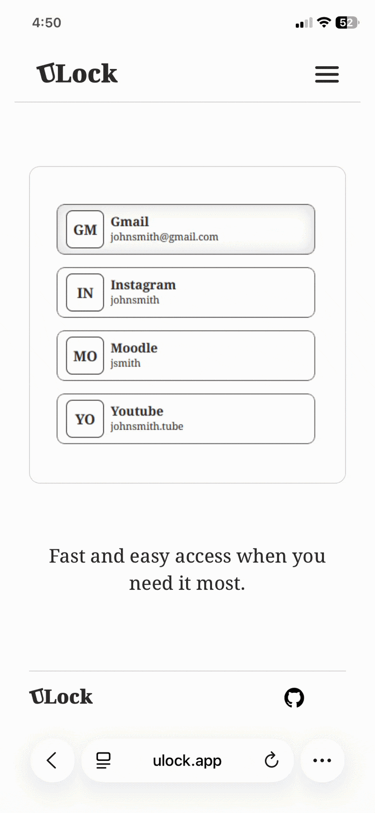
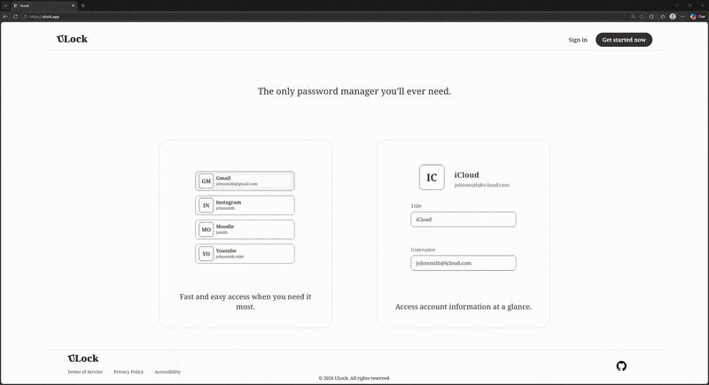
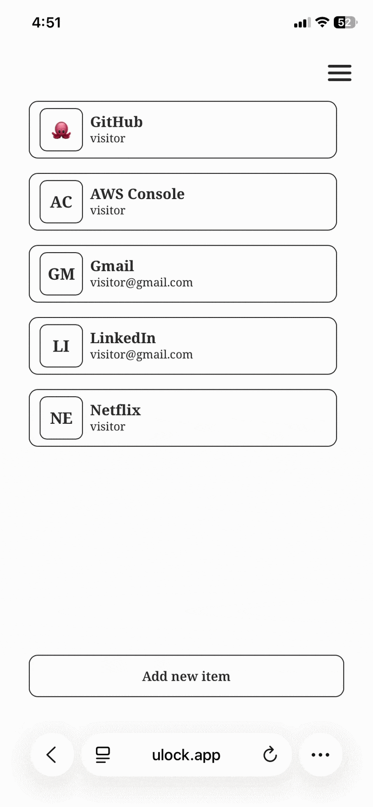
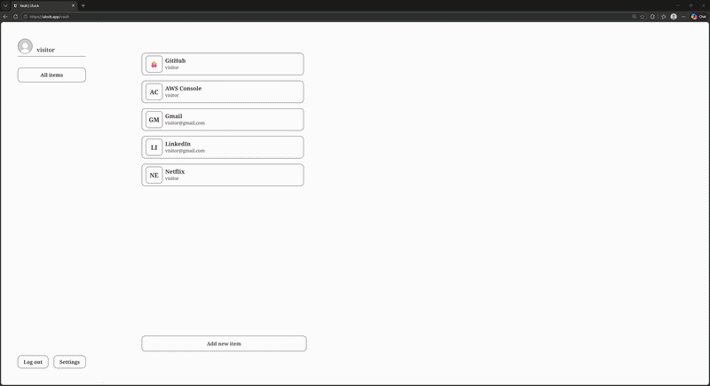

# ULock

A simple, secure password manager for desktop and mobile.

**[ulock.app](https://ulock.app)**

---

### Access your encrypted accounts anywhere

<table>
  <tr>
    <td></td>
    <td></td>
  </tr>
</table>

### Store passwords through an easy-to-use vault

<table>
  <tr>
    <td></td>
    <td></td>
  </tr>
</table>

---

## Features

- **Vault** — store, edit, and delete credentials
- **Encryption** — passwords are encrypted client-side before leaving your device
- **Demo mode** — try the app without creating an account
- **Emoji icons** — use an emoji prefix as a custom vault entry icon
- **Responsive** — works on desktop and mobile

## Tech

